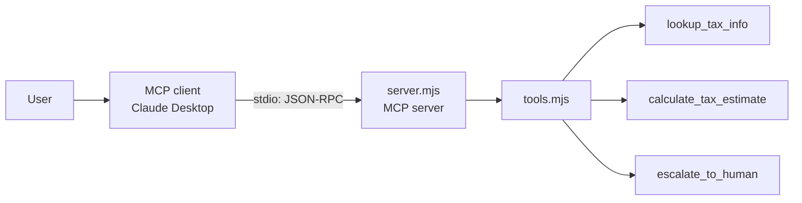
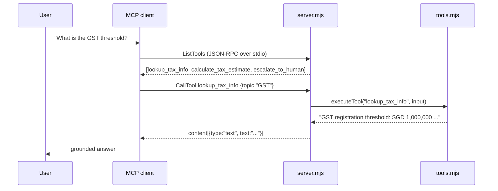
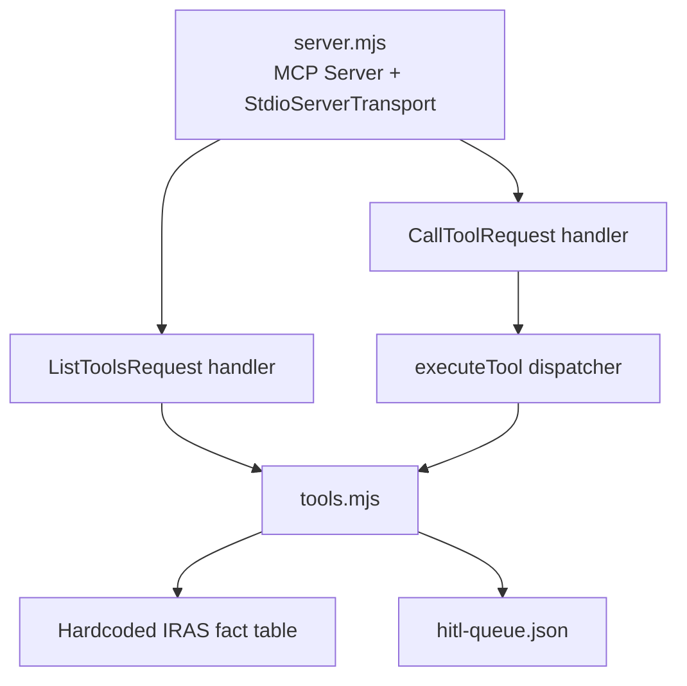

# iras-mcp-server

[](https://github.com/elleskay/iras-mcp-server/actions/workflows/ci.yml)

A Model Context Protocol (MCP) server that exposes a small set of Singapore tax tools to any MCP client (such as Claude Desktop). It gives an LLM three concrete, auditable capabilities: look up factual IRAS tax rules, compute a rough chargeable-income estimate, and escalate anything that needs personalised advice to a human. The server speaks MCP over stdio, has no network dependencies, and runs entirely locally.

Repo: [github.com/elleskay/iras-mcp-server](https://github.com/elleskay/iras-mcp-server)

> Educational portfolio project. Not affiliated with or endorsed by IRAS (Inland Revenue Authority of Singapore). The tax facts are hardcoded and illustrative; do not use them as a basis for real tax decisions.

## Why this exists

Letting an LLM answer tax questions freehand is risky: it will confidently invent thresholds and rates. The MCP pattern fixes that by giving the model a narrow set of tools instead of a blank prompt. This server demonstrates three patterns that matter for any regulated-domain assistant:

- Grounded lookup: facts come from a known table, not the model's memory.
- Bounded computation: arithmetic runs in code, and every result carries an explicit "this is an estimate" disclaimer.
- Human-in-the-loop (HITL) escalation: when a question exceeds the tools, the server queues it for a human advisor rather than guessing.

## Demo

The server has no UI. It is wired into an MCP client, which then calls its tools on the model's behalf. Below is a full local run.

### 1. Install and sanity-check

```bash
npm install
npm test
```

```text
✔ lookup_tax_info returns GST threshold
✔ calculate_tax_estimate returns correct chargeable income
✔ escalate_to_human writes to queue and returns case number
ℹ tests 3
ℹ pass 3
ℹ fail 0
```

### 2. Register it in Claude Desktop

Add this to `claude_desktop_config.json` (macOS: `~/Library/Application Support/Claude/`, Windows: `%APPDATA%\Claude\`):

```json
{
  "mcpServers": {
    "iras-tax": {
      "command": "node",
      "args": ["C:/dev/iras-mcp-server/server.mjs"]
    }
  }
}
```

Use the absolute path to `server.mjs` on your own machine. Restart Claude Desktop; the `iras-tax` tools then appear to the model.

### 3. Example tool calls and results

`lookup_tax_info` with `{ "topic": "GST" }`:

```text
GST registration threshold: SGD 1,000,000 in taxable turnover over 12 months.
```

`calculate_tax_estimate` with `{ "income": 120000, "deductions": 25000 }`:

```text
Estimated chargeable income: SGD 95,000. (Income SGD 120,000 minus deductions
SGD 25,000.) This is a rough estimate only, actual tax liability depends on
reliefs, residency status, and IRAS assessment. Consult a tax professional
for personalised advice.
```

`escalate_to_human` with `{ "reason": "...", "original_query": "..." }`:

```text
Your query has been escalated to a human tax advisor (case #1717430400000).
They will follow up with personalised advice.
```

The escalation is appended to a local `hitl-queue.json` file as a pending case.

## What it does

| Tool | What it does | Inputs |
|------|--------------|--------|
| `lookup_tax_info` | Returns a factual Singapore tax rule (GST threshold, income tax deadline, corporate tax rate, SRS limits) from a known table | `topic` (string) |
| `calculate_tax_estimate` | Computes chargeable income as `max(0, income - deductions)` and returns it with a mandatory estimate disclaimer | `income` (number, SGD), `deductions` (number, SGD) |
| `escalate_to_human` | Records a HITL case in `hitl-queue.json` with a timestamp and `pending` status, and returns a case number | `reason` (string), `original_query` (string) |

Tool definitions are published to clients as JSON Schema, so the model knows each tool's name, purpose, and required arguments.

## How it fits together

An MCP client owns the conversation and the model. This server only advertises tools and runs them when asked, all over stdio.



### One tool call over MCP



### Logical architecture



## Tech stack

| Concern | Choice |
|---------|--------|
| Language / runtime | Node.js (ES modules, `>=18`; tested on 20) |
| Protocol | Model Context Protocol via `@modelcontextprotocol/sdk` ^1.0.0 |
| Transport | stdio (`StdioServerTransport`) |
| HITL store | Local `hitl-queue.json` (flat file) |
| Tests | `node --test` (built-in test runner) |
| CI | GitHub Actions |
| Dependencies | One runtime dependency (the MCP SDK) |

## Local development

```bash
npm install        # install the MCP SDK
npm start          # run the server over stdio (Ctrl+C to exit)
npm test           # run the test suite
```

`npm start` produces no visible output until an MCP client connects; that is expected for a stdio server. There are no API keys: `.env.example` documents that all handlers are local and the server makes no outbound LLM calls.

## Testing

Tests live in `tests/server.test.mjs` and exercise each tool handler directly with the built-in Node test runner:

- `lookup_tax_info` returns the correct GST threshold.
- `calculate_tax_estimate` computes chargeable income correctly.
- `escalate_to_human` writes a case to the queue and returns a case number (the test cleans up the queue file afterward).

CI runs on every push to `main` (`.github/workflows/ci.yml`): it checks out the repo, sets up Node 20 with npm cache, runs `npm ci`, then `npm test`. There is no deployment step; the server is meant to be installed and run locally by an MCP client.

## Project structure

```text
iras-mcp-server/
├── server.mjs              # MCP server: wires transport + request handlers
├── tools.mjs               # Tool handlers, JSON Schema definitions, dispatcher
├── tests/
│   └── server.test.mjs     # node --test suite for the three handlers
├── .github/workflows/
│   └── ci.yml              # GitHub Actions: npm ci + npm test on push to main
├── .env.example            # Documents that no API keys are needed
├── package.json
└── README.md
```

## License

No license file is currently included. Treat this as a personal portfolio project: please ask before reusing it in your own work.
